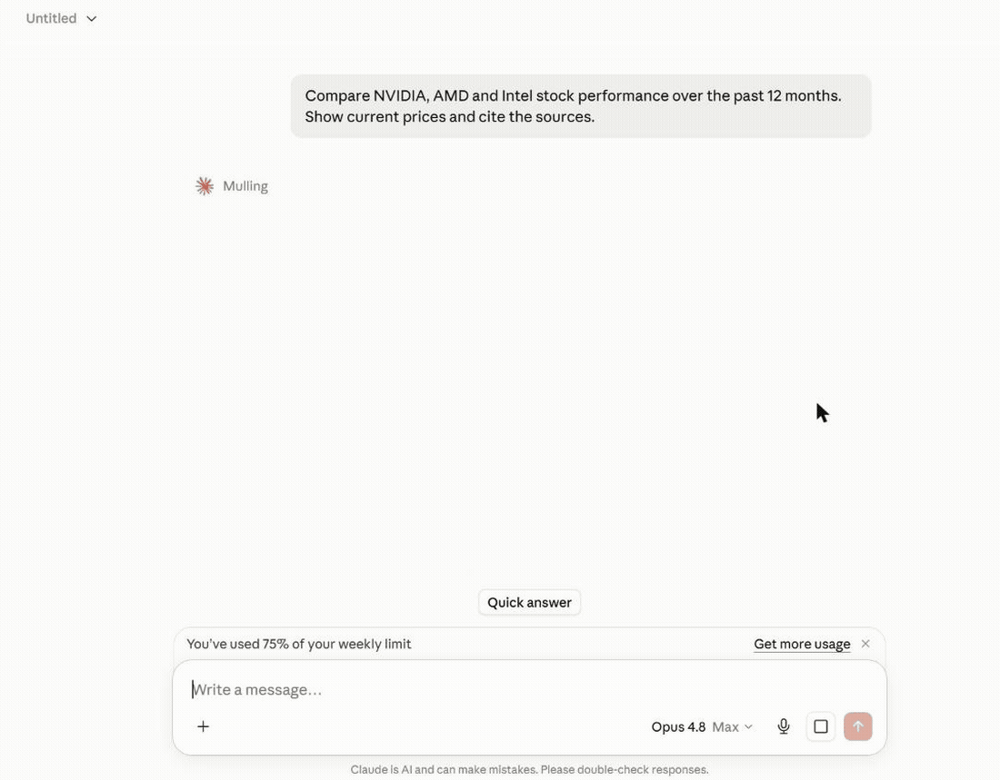
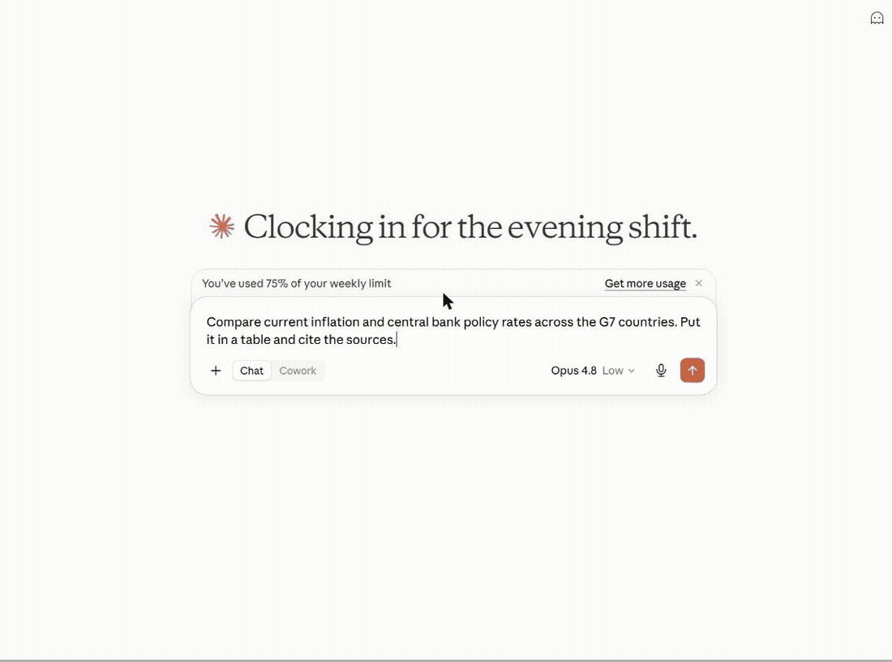
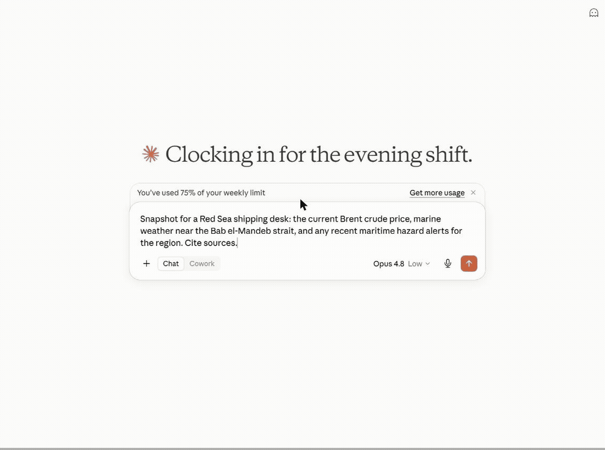
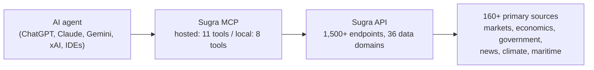

# sugra-api-mcp

<!-- mcp-name: ai.sugra/api-mcp -->

<p align="center">
  
</p>

<p align="center">
  <a href="https://pypi.org/project/sugra-api-mcp/"></a>
  <a href="https://pypi.org/project/sugra-api-mcp/"></a>
  <a href="https://github.com/Sugra-Systems/sugra-api-mcp/blob/main/LICENSE"></a>
</p>

<p align="center">
  <a href="https://chatgpt.com/plugins/plugin_asdk_app_6a33ce728e488191a82df247ab605e91"></a>
</p>

<p align="center">
  <sub>Published in the official OpenAI Plugins Directory. Available for ChatGPT and Codex.</sub>
</p>

**Give any AI agent access to 1,500+ data endpoints across markets, economics, companies, government, news, climate, maritime and entity screening - through one MCP server.**

Works with ChatGPT, Claude, Gemini, xAI, Cursor, VS Code and any MCP client.

Official [Model Context Protocol](https://modelcontextprotocol.io) server for the [Sugra API](https://sugra.ai): one connector, a bundled endpoint catalog, and structured tool results with source attribution on every answer.

## See it in action

An agent answering a real question end to end - resolving entities, pulling live snapshots and history, and citing the source and freshness on every number:



More examples:

**Macro research** - one prompt builds a full G7 inflation and policy-rate table, each cell dated and sourced, with the unavailable ones flagged rather than faked:



**Cross-domain snapshot** - Brent crude, marine weather and regional risk pulled together for a shipping desk, each with its source and timestamp:




## What a session looks like

Hosted MCP transcript (the three composed tools shown here run on the hosted endpoint). Captured example - wording and figures vary by run and as new BLS data is published:

```text
User: Where does US inflation stand, and how has it trended over the past year?

resolve_entity("US inflation")
  -> macro indicator cpi_us (U.S. Bureau of Labor Statistics)
get_snapshot("cpi_us")
  -> latest reading with freshness, provenance and quota cost
get_timeseries("cpi_us", metric="macro_series", range="1y")
  -> 12 monthly points with an explicit downsampling flag

Agent: US CPI printed 2.9% year over year in the latest release, down from
3.5% twelve months earlier - a steady decline since spring.
Source: U.S. Bureau of Labor Statistics via the Sugra API.
```

Every tool result carries structured metadata - source attribution, freshness, and rate-limit cost - so agents can cite sources and budget requests instead of guessing.

## How it works



Behind the gateway sits the Sugra API: 160+ primary sources - sovereign statistics agencies, central banks, intergovernmental bodies and more - feeding 1,500+ endpoints across 36 data domains. The server ships a bundled catalog of the full endpoint surface, so discovery (search, describe, toolsets) runs locally without network calls; only actual data requests hit the API.

## What agents build with it

Six workflow prompts ship with the server and turn these into one-click flows in clients that surface MCP prompts:

- **Market and macro research** - "Compare inflation and central bank policy rates across the G7." (`macro_briefing`)
- **Equity snapshots with sources** - "Where does NVIDIA stand today - price, profile, and market backdrop?" (`market_snapshot`)
- **Sanctions and compliance screening** - "Screen this supplier and resolve its LEI identity." (`sanctions_screening`)
- **Sector comparison** - "Energy versus technology: valuations and flows side by side." (`sector_compare`)
- **Climate, maritime and trade intelligence** - "Red Sea shipping this week: chokepoint transits, crude price, and weather on the route." (`earth_conditions` plus the transport and commodities catalog)
- **Source discovery** - "What does the catalog offer for fixed income, and from which institutions?" (`source_overview`)

Every answer carries source attribution and freshness metadata, so agents cite instead of guessing.

## Hosted MCP (recommended)

No install. Point your client at the hosted Streamable HTTP endpoint:

```
https://app.sugra.ai/mcp
```

- 11 tools: the eight gateway tools plus three composed agent tools (`resolve_entity`, `get_snapshot`, `get_timeseries`)
- OAuth sign-in through the claude.ai and ChatGPT connector UIs, or `Authorization: Bearer sugra_xxx_...` with an API key
- In claude.ai: Settings -> Connectors -> Add custom connector
- In ChatGPT: Settings -> Connectors -> Add MCP server

## Local package

Runs on your machine over stdio (or self-hosted HTTP) with an API key:

```bash
pip install sugra-api-mcp
```

- Eight gateway tools
- stdio for desktop clients and IDEs, Streamable HTTP for self-hosting
- Authenticates with `SUGRA_API_KEY`

Get a free API key at [app.sugra.ai/settings/billing](https://app.sugra.ai/settings/billing) (Free tier: 50 req/day).

## Quick start

```bash
pip install sugra-api-mcp
export SUGRA_API_KEY=sugra_xxx_...   # free key: app.sugra.ai/settings/billing
sugra-api-mcp call quotes_symbol_price --params '{"symbol":"AAPL"}'
```

The same call through an agent: connect the server to your client (next section) and ask "What is AAPL trading at? Use Sugra." The agent finds `quotes_symbol_price` in the catalog and calls it with the symbol.

## Connect your client

Supported clients:

- **Anthropic Claude**: Claude Desktop, Claude Code (CLI), claude.ai (web)
- **OpenAI GPT**: ChatGPT (via MCP connector)
- **Google Gemini**: Gemini CLI, Gemini Code Assist (VS Code + JetBrains)
- **xAI**: Remote MCP Tools in xAI SDK and Responses API
- **IDEs**: VS Code (native), Cursor, Zed, Cline, Continue.dev, Windsurf
- **Custom agents**: anything built on the Python or TypeScript MCP SDK

### Claude Desktop (stdio)

Add to `claude_desktop_config.json`:

- macOS: `~/Library/Application Support/Claude/claude_desktop_config.json`
- Windows: `%APPDATA%\Claude\claude_desktop_config.json`
- Linux: Claude Desktop has no Linux build. On Linux, `pip install sugra-api-mcp` and use Claude Code (CLI), an IDE client, or the hosted HTTP endpoint below.

```json
{
  "mcpServers": {
    "sugra": {
      "command": "sugra-api-mcp",
      "env": {
        "SUGRA_API_KEY": "sugra_xxx_yourkey..."
      }
    }
  }
}
```

Restart Claude Desktop. Sugra tools appear in the tools menu.

### Claude Code (Anthropic CLI)

```bash
claude mcp add sugra -- sugra-api-mcp
# then set the env var that sugra-api-mcp reads
export SUGRA_API_KEY=sugra_xxx_...
```

Or edit `~/.claude/config.json` manually with the same shape as Claude Desktop above.

### Cursor, Zed, Cline, Continue.dev, Windsurf

Each of these has an MCP settings file (typically `mcp.json` or equivalent) with the same stdio config shape as Claude Desktop.

### ChatGPT

ChatGPT supports MCP through its connector UI. Use the hosted HTTP endpoint (below) since ChatGPT does not launch local stdio processes.

### HTTP (claude.ai, ChatGPT, remote agents)

Hosted Streamable HTTP endpoint:

```
https://app.sugra.ai/mcp
```

Add to claude.ai, ChatGPT, or any Streamable HTTP MCP client. Authenticate with `Authorization: Bearer sugra_xxx_...`.

In claude.ai: Settings -> Connectors -> Add custom connector.
In ChatGPT: Settings -> Connectors -> Add MCP server.

## Tool reference

The local package exposes eight gateway tools. The hosted endpoint adds three composed analysis tools on top (see Hosted MCP above). The package exposes exactly eight tools:

| Tool | Purpose |
|---|---|
| `fetch_data` | One-step: find best endpoint for a natural-language query and call it. Combines search + call in one round trip. |
| `search_endpoints` | Search the bundled endpoint catalog. Runtime search does not fetch `/openapi.json`. |
| `describe_endpoint` | Inspect an endpoint by `operation_id`, including path, method, parameters, required inputs, `agent_hints`, and `request_body_schema` for JSON-body POST operations. |
| `call_endpoint` | Call a Sugra API operation by `operation_id`. Arbitrary path calls are no longer supported. |
| `list_toolsets` | List catalog groups with endpoint counts and descriptions. |
| `list_sources` | Show bundled catalog source metadata. |
| `sugra_entity_screen` | Screen a name against sanctions and watchlists (Sugra Entity). |
| `sugra_entity_lookup` | Composed entity lookup by identifier - `anchor` is `lei` or `vat`, plus the identifier `value`; returns registry identity + screening (Sugra Entity). |

`call_endpoint` and `fetch_data` both support response shaping with `limit`, `fields`, and `include_raw`. Shaping works on enveloped (`{"data": ...}`) and envelope-less payloads alike; `fields` entries may use dotted paths into nested objects (`geo.city`), and `meta.shaped` reports what was actually applied (`fields_applied` / `fields_unmatched`, `limit_applied`) rather than echoing the request.

`describe_endpoint` returns computed `agent_hints` per endpoint so agents can budget time and parallelism before calling:

- `duration_class` - `fast` (under ~2s, snapshot-backed), `slow` (live upstream proxying, occasionally 15s+), or `heavy` (per-item upstream work, large batches can exceed the gateway timeout)
- `max_concurrency` - advisory ceiling for parallel calls from one session
- `bulk_cost` - on per-item bulk endpoints: 1 request credit per item in the request body (the API reports the total in the `X-RateLimit-Cost` response header)

### Hosted-only agent tools (app.sugra.ai/mcp)

The hosted MCP endpoint at `https://app.sugra.ai/mcp` serves the same eight tools PLUS three composed agent tools that are not available on stdio or self-hosted installs:

| Tool | Purpose |
|---|---|
| `resolve_entity` | Free text (ticker, company, indicator, coin, currency pair) to a canonical market or macro entity. Ambiguous matches return ranked candidates, never a silent pick. |
| `get_snapshot` | Entity plus a named recipe to one composed current view with freshness, provenance, coverage, and billing blocks. Composed calls charge a fixed recipe cost (1-2 requests) from the daily quota. |
| `get_timeseries` | Entity plus metric (`price`, `macro_series`, `etf_flows`) to a bounded series with an explicit downsampling flag. |

These three tools wrap an internal composed plane that requires an infrastructure credential available only on the hosted deployment. The tool code ships inside the package, but it is registered only by the hosted HTTP entry point and only when that credential is present - `pip install sugra-api-mcp` (stdio and self-hosted HTTP) always exposes the classic eight-tool gateway. Hosted-only examples in any documentation are labeled as such. For compliance entity lookups (LEI / VAT, sanctions screening) use `sugra_entity_lookup` and `sugra_entity_screen`, which work on every transport.

## CLI

Server startup is unchanged:

```bash
sugra-api-mcp
sugra-api-mcp --transport streamable-http --port 8001
```

Catalog and gateway helpers:

```bash
sugra-api-mcp doctor
sugra-api-mcp list-toolsets
sugra-api-mcp search "NASDAQ futures"
sugra-api-mcp describe cot_financial
sugra-api-mcp call quotes_symbol_price --params '{"symbol":"AAPL"}'
```

## Environment variables

User-facing configuration for local installs, MCP clients, Docker stdio, and
directory sandboxes (for example Glama Try in Browser). Set only this:

| Variable | Required | Default | Description |
|---|---|---|---|
| `SUGRA_API_KEY` | For API calls | - | Your Sugra API key (`sugra_...`). Get a free key at [app.sugra.ai/settings/billing](https://app.sugra.ai/settings/billing) (Free tier: 50 req/day). Not needed to start the server: catalog tools (`search_endpoints`, `describe_endpoint`, `list_toolsets`, `list_sources`) work without it; API-calling tools return a structured `missing_api_key` error until it is set. In HTTP mode with a client Bearer token this is only a fallback. |

Optional overrides (leave unset unless you need them):

| Variable | Default | Description |
|---|---|---|
| `SUGRA_API_BASE` | `https://sugra.ai` | Override the Sugra API base URL (self-hosted or beta API only). |
| `SUGRA_TIMEOUT` | `30` | Downstream HTTP timeout in seconds for calls from this server to the Sugra API. |

Operator-only settings for self-hosted Streamable HTTP (reverse proxy CORS/hosts,
OAuth authorization-server wiring, and shared secrets) are documented in
[docs/self-hosting.md](docs/self-hosting.md). Do not put operator secrets into
public directory sandboxes.

### HTTP transport with OAuth

When running with `--transport streamable-http` the server allows unauthenticated MCP discovery requests (`initialize`, `notifications/initialized`, `tools/list`, `resources/list`, `prompts/list`, and `ping`) so ChatGPT Apps and other mixed-auth clients can discover tool metadata. Tool calls still require `Authorization: Bearer ...`. Two token formats are accepted:

- Raw API key (`sugra_...`) - passed through as the downstream `x-api-key`. Compatible with earlier local API-key setups.
- OAuth JWT - signature verified against the issuer's JWKS. The audience must match `https://app.sugra.ai/mcp`, the token must include `sugra:read`, and hosted access is validated against APP before resolving the user's primary API key. Successful hosted OAuth requests update MCP connection activity in APP.

Most users should use the hosted endpoint `https://app.sugra.ai/mcp` instead of
self-hosting OAuth. If you run your own HTTP process, see
[docs/self-hosting.md](docs/self-hosting.md).

## Timeouts and the error contract

`SUGRA_TIMEOUT` caps each downstream HTTP call from this server to the Sugra API (default 30 seconds). It is one link in a longer chain; when a tool call fails, `elapsed_ms` in the error payload tells you which link cut it:

```
MCP client (agent harness)         own tool timeout, often 60-180s, client-controlled
  -> hosted proxy (app.sugra.ai)   86400s, effectively unlimited
    -> this server (httpx)         SUGRA_TIMEOUT, default 30s
      -> Sugra API -> upstreams    15-60s per upstream call, server-side
```

Tool failures return structured JSON instead of raising, so agents can pick a retry strategy:

| `error` value | Meaning | Retry strategy |
|---|---|---|
| `upstream_timeout` | No response within `SUGRA_TIMEOUT` (`elapsed_ms` close to `timeout_s` x 1000) | Retry once: the aborted attempt usually completes server-side and warms upstream caches. Then narrow the request (smaller batch, tighter filters). |
| `upstream_connect_error` | Could not reach the Sugra API (DNS failure, connection refused) | Retry after a short delay. |
| `upstream_transport_error` | Connection dropped mid-request | Retry once. |
| free-text string + `status_code` | The API answered with HTTP 4xx/5xx; `retry_after` included when the API sent a Retry-After header | Honor `retry_after` for 429/503; fix the request for 4xx. |
| `tool_execution_failed` | Unexpected failure inside the gateway (`exception_type` included) | Report if persistent. |

All error payloads carry `elapsed_ms`. `url` is present on transport and HTTP errors (not on `tool_execution_failed`, which can fire before a URL exists). On the three transport errors `status_code` is `null` (no HTTP status was received) - consumers comparing `status_code` numerically should guard for that. If a tool call instead fails with a bare client-side message and no structured JSON, the timeout fired in your agent harness above this server: raise the client's tool timeout, not `SUGRA_TIMEOUT`.

## Examples

Ask Claude:

- "Search Sugra endpoints for NASDAQ futures."
- "Describe the `cot_financial` operation."
- "Call `quotes_symbol_price` with symbol AAPL and return only symbol and price."
- "List available Sugra toolsets."

## Troubleshooting

**Looking for `get_market_price`, `get_macro_indicator`, or `get_news`?** Those curated tool names appear in some older directory listings and never shipped in this package - use `fetch_data` for one-step natural-language calls or `search_endpoints` plus `call_endpoint` for explicit routing.


**`missing_api_key` in tool responses**

The server starts and lists its tools without a key, but API-calling tools (`call_endpoint`, `fetch_data`, the entity tools) return `{"error": "missing_api_key"}` until the server can find one. Depending on how you run it:
- As an MCP tool from your client (Claude, ChatGPT, Gemini, xAI, IDE, etc.): check the `env` block in your MCP config file. Value should be a full key like `sugra_ao1_...`, not empty and not wrapped in extra quotes.
- Shell / CI: `export SUGRA_API_KEY=sugra_...` before running `sugra-api-mcp`.
- HTTP mode: set via `.env` or systemd `EnvironmentFile`, not the shell.

`sugra-api-mcp doctor` reports whether the key is visible to the process.

**`401 Unauthorized` or `403 Forbidden` in tool responses**

Key accepted but rejected. Common causes:
- Key was regenerated in [app.sugra.ai/settings/billing](https://app.sugra.ai/settings/billing) and your config still has the old one.
- Typo - key contains only lowercase letters and digits, no spaces, no trailing newlines.
- Free tier was deactivated. Sign in to verify status.

**`429 Too Many Requests`**

Hit your plan's daily limit. Response headers include `X-RateLimit-Reset` with the UTC timestamp when the counter resets (midnight UTC). Upgrade your plan at [app.sugra.ai/settings/billing](https://app.sugra.ai/settings/billing).

**`Invalid Host header`** (only if self-hosting HTTP mode)

FastMCP has DNS rebinding protection for public hostnames behind a reverse
proxy. See [docs/self-hosting.md](docs/self-hosting.md) for the allowed-hosts
setting.

**Tool result truncated with `meta.truncated` notice**

Some endpoints return very large payloads (global wildfires, full table catalogs). The client enforces the MCP 25k token limit - when hit, the data list is trimmed and a retry hint appears in `meta.truncated.retry_hint`. Add narrower filters (country, date range, `limit`) to get the full result.

**`Python version 3.11 or higher is required`**

sugra-api-mcp requires Python 3.11+. Check: `python --version`. If you have 3.10 or older:
- Ubuntu: install Python 3.11 or newer from your distribution packages or the deadsnakes PPA.
- macOS: `brew install python@3.11`
- Windows: download from [python.org](https://www.python.org/downloads/)

Then recreate your venv.

**Hosted `app.sugra.ai/mcp` returns 5xx**

The hosted endpoint can briefly restart after deploys. Wait 60 seconds and retry. If persistent, email support@sugra.systems.

**Debugging tool calls locally**

Run with stdio and log JSON-RPC messages:
```bash
SUGRA_API_KEY=sugra_... sugra-api-mcp 2>&1 | tee mcp-debug.log
```
Send manual JSON-RPC from a second terminal using `nc` or an MCP inspector.

## Development

```bash
git clone https://github.com/Sugra-Systems/sugra-api-mcp
cd sugra-api-mcp
pip install -e ".[dev,http]"
export SUGRA_API_KEY=sugra_...
python -m sugra_api_mcp  # stdio mode
python -m sugra_api_mcp --transport streamable-http --port 8001  # HTTP mode
python scripts/build_endpoint_catalog.py  # rebuild bundled catalog from sibling API openapi.json
```

Run tests:

```bash
pytest
```

## Docker

Build the image from the repository root:

```bash
docker build -t sugra-api-mcp .
```

Run in stdio mode (the default entrypoint) for MCP clients that spawn a local process:

```bash
docker run -i --rm -e SUGRA_API_KEY=sugra_... sugra-api-mcp
```

Run the Streamable HTTP transport on port 8001 with Docker Compose:

```bash
export SUGRA_API_KEY=sugra_...
docker compose up -d
```

Then point your MCP client at `http://localhost:8001/mcp`. The compose service
passes `SUGRA_API_KEY` and the optional overrides (`SUGRA_API_BASE`,
`SUGRA_TIMEOUT`) from your shell when set, and checks container health against
`http://localhost:8001/health`. Reverse-proxy and OAuth operator settings are
documented in [docs/self-hosting.md](docs/self-hosting.md).

A note on auth: no environment variable is baked into the image and none is
required for the container to start. In HTTP mode clients authenticate per
request with `Authorization: Bearer sugra_...`, so `SUGRA_API_KEY` on the
container is only a fallback for requests without a Bearer token.

## License

MIT © 2026 Sugra Systems, Inc.
